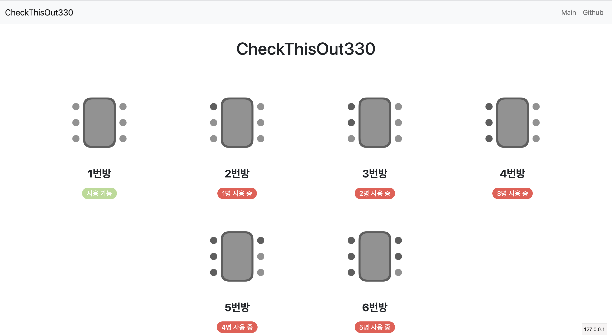

# CheckThisOut330 메인 레포

### 기능

* 데이터 저장, 불러오기 구현
* 실시간 갱신
* 너무 오래된 데이터 필터링
* 사람 수에 따라 이미지 교체
* 깔끔한 디자인

### Screenshot


### To do list

* [x] DB 모듈 개발
* [x] UI 설계
* [x] 프론트엔드 개발
* [x] 백엔드 개발

### 테스트
실행법 :
```bash
python3 main.py
```
```py
import requests
result = requests.post("http://0.0.0.0:8000/api/", json={"room": 1, "count": 0})
result = requests.post("http://0.0.0.0:8000/api/", json={"room": 2, "count": 1})
result = requests.post("http://0.0.0.0:8000/api/", json={"room": 3, "count": 2})
result = requests.post("http://0.0.0.0:8000/api/", json={"room": 4, "count": 3})
result = requests.post("http://0.0.0.0:8000/api/", json={"room": 5, "count": 4})
result = requests.post("http://0.0.0.0:8000/api/", json={"room": 6, "count": 5})
```
